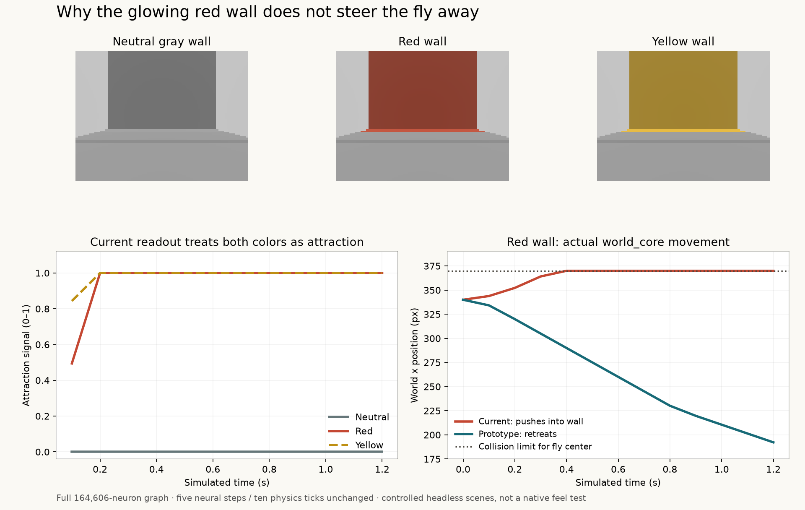

> Historical investigation from 12 September 2026, archived 13 September 2026. Its recommendations were subsequently implemented. Descriptions of the old controller below are historical, not the current game. Raw cache/build products and individual input frames are excluded. The identical anatomical atlas is already tracked at `assets/brain_atlas.json` in the project root and is not duplicated here. Existing commands refer to the original runs directory and historical prepared state; this archive is not a current validation harness.

# Movement investigation — Fly & You

The current controller interprets both red and yellow as attraction, saturates its motor signal, and continues commanding movement into a wall after collision stops the body. I recommend two distinct chromatic sensory channels, a fixed readout over responsive downstream neurons, and an explicit approach/retreat/search controller with committed reversals. This matches the requested rule: **red repels; yellow attracts**.

This is an investigation and an isolated prototype. The native game, prepared production profile, physics, protocol, and app bundle were not changed. The original experiments ran in ignored `runs/movement-investigation`; this directory archives their sources and compact evidence. The prototype uses the full existing 164,606-neuron, 25,558,671-connection graph and the existing five-neural-step/ten-physics-tick decision contract. Its channel assignments and color valences are engineered game rules, not claims about biological color preference.



## What is happening now

The retina in [model.py](baseline/controller/brainworker/model.py) keeps only `max((R-B-48)/200, 0)`. Green is discarded. Two colors with identical red and blue components are therefore indistinguishable to the entire neural model, regardless of how different their green components are. Retuning a downstream gain cannot recover that lost information.

Movement averages 4,589 left and 4,612 right visual-projection neurons into one positive attraction value. Its expression is `clip(3000 * (mean_rate - 0.00023), 0, 1)`, which saturates above a mean rate of approximately 0.0005633. A strong cue prevents the search timer from reversing direction, while increasing speed in the existing heading. There is no red avoidance term and no collision feedback in that readout.

The static full-graph probe used identical initial model and RNG state for each condition, holding a real eye-level rendered observation for 40 decisions:

| Observation | Final visual-projection mean rate | Attraction | Final motor command |
|---|---:|---:|---:|
| Neutral gray wall | 0.0002138 | 0 | -0.442, following the timed search reversal |
| Red wall | 0.0008504 | 1 | +1.000 |
| Yellow wall | 0.0011827 | 1 | +1.000 |
| Red floor patch | 0.0014672 | 1 | +1.000 |
| Yellow floor patch | 0.0018778 | 1 | +1.000 |

Both wall colors reached maximum attraction by the second decision; both floor colors did so on the first. The larger yellow neural response produces essentially the same saturated command as red. The brain panel separately highlights local relative activity increases across its sampled atlas; bright orange does not identify a turning command.

The most recent recorded play, `play-f6ccd9341372`, contained red strokes starting at physics tick 450. Later commands approached -1 while keeping the pre-existing leftward direction. This is consistent with red strengthening the current heading. That journal contains no body-position trace, so the controlled physics experiment below supplies the collision evidence.

## How left/right should be decided

The camera's horizontal image axis lies across the corridor depth, while the character travels along the corridor. Image-left and image-right therefore do not directly mean map-left and map-right. Subtracting the current bilateral visual rates would use the wrong spatial interpretation.

The useful local decisions are **continue in the current direction** or **turn around**, driven by cue valence. A forward image cannot reveal an unseen cue behind the fly. Finding such a cue requires turning and observing again; it cannot be inferred from the current frame alone.

The prototype does this without passing map geometry, coordinates, goals, or labels into the controller:

1. **Preserve color identity.** At the existing stratified sample coordinates, encode yellow as `clip((min(R,G)-B-24)/160, 0, 1)` and red as `clip((R-max(G,B)-48)/160, 0, 1)`. The existing yellow and red palette entries select their intended channel. Gray, blue, green, and black palette entries have zero direct chromatic input.
2. **Keep a causal neural path.** Partition the existing sensory population deterministically into two interleaved groups. Select non-input neurons with more than 5% positive incoming weight from one group, and more than 90% of their positive retinal input from that group. This gives 2,183 yellow-channel and 2,139 red-channel readout neurons, almost entirely optic-lobe intrinsic neurons. They are actual postsynaptic cells; their modeled activity, not raw RGB, feeds movement.
3. **Measure persistent evidence.** Subtract a fixed neutral calibration baseline from each population mean. Do not continuously adapt that baseline to the active cue, which would make a stationary colored surface fade out of the decision. Normalize the excess rates before comparing channels.
4. **Use explicit motor states.** Stronger red evidence reverses the internal heading once and commits to 0.8 simulated seconds of retreat. Separate entry and rearm thresholds, plus three clear observations, prevent repeated reversals while old activity is decaying. Yellow increases forward speed with a smooth saturating response and clears the search timer. Neutral observations retain 52% exploration and the existing 35-decision search interval. Persistent red after the retreat commitment ends produces a hold instead of rapid oscillation.
5. **Let physics smooth velocity once.** The prototype removes the additional 0.65 motor low-pass. It still uses the existing 1,056 px/s² acceleration limit, 176 px/s maximum speed, gravity, collision, and stepping. It never changes position directly.

The prototype has hand-chosen gains and thresholds; this is not a trained navigation policy. Its maximum retreat drive is 0.85. Small or distant cues can fall below the evidence threshold. Native play should determine whether retreat duration, sensitivity, and the remaining neutral search behavior feel right.

## Measured movement and causal checks

The headless driver invokes the existing `world_core` renderer and body simulation. Scene coordinates stay in the harness; each controller receives only the rendered RGB array. The short motion comparison used two RNG seeds not used to choose the prototype settings, four scene orientations, and 12 decisions per trial: 16 trials total.

| Scene, starting at x = 340 | Current displacement after 1.2 simulated seconds | Prototype displacement |
|---|---:|---:|
| Red wall ahead, facing right | +30.00 px, stopped against wall | -147.75 px, retreating left |
| Red wall ahead, facing left | -30.00 px, stopped against wall | +147.75 px, retreating right |
| Yellow floor patch ahead, facing right | +157.38 to +157.39 px | +141.19 px |
| Yellow floor patch ahead, facing left | -156.94 to -156.93 px | -141.07 to -141.06 px |

The two seeds agreed on the qualitative behavior in every tested scene. Yellow already accelerates the current controller; the improvement is a distinct red response and stable direction decisions, not a claim that the prototype always travels farther.

A separate transition check first let each controller approach a yellow floor cue for five decisions, then removed that ink and painted the wall red. The current controller continued right and remained at the collision limit, x = 430. The prototype issued its first retreat command on decision 7, the second observation after recoloring, reversed physical velocity during that block, and finished at x = 291.22. This checks lingering attraction and body inertia; it does not establish collision-free avoidance of late cues.

Two matched-seed ablations produced identical red/yellow action traces:

- Disconnecting retinal currents removed color-dependent movement.
- Zeroing synaptic weights also removed color-dependent movement, even though sensory neurons still received currents.

These checks establish that the prototype's movement distinction depends on the neural path. They do not establish broad usability or biological fidelity.

## Alternatives considered

**Retune the existing average and gain:** insufficient. It could reduce saturation, but cannot restore the discarded green channel or make red repulsive. It also leaves direction tied to the search timer.

**Read known descending motor neurons directly:** a reasonable separate research direction, but not a demonstrated replacement here. DNa02 and PFL circuits have measured roles in biological steering and head-direction transformations; those results involve functional signals and dynamics that this rate approximation does not automatically reproduce. See [Westeinde et al., Nature 2024](https://www.nature.com/articles/s41586-024-07039-2). In this specific probe, the mean DNa02 red-versus-neutral increase was about 0.00000215, against neutral temporal standard deviation of about 0.000101 over decisions 11–40. That limited population-mean measurement is not a complete evaluation of a bilateral motor decoder. More fundamentally, changing the output cells alone still cannot recover information discarded by the current retina.

**Two neural chromatic signals and a fixed motor state machine:** recommended for the next implementation. The isolated prototype demonstrates the requested red/yellow distinction with the full graph and current body contract. It makes the intended game semantics explicit and testable.

## Scope of a production implementation

Prepare and version the channel mapping, downstream populations, neutral calibration, and gains in a new controller profile. Keep the current eye-level renderer; change the retina/profile declaration consistently in `prepare.py` and `model.py`. Extend neural snapshots to include every new motor-state field: heading, retreat commitment, rearm state, clear-observation count, and search age. Keep current epoch, step, tick, revision, image-hash, and profile checks.

Expose approach evidence, avoidance evidence, and motor state through inspection and the existing floating toolbox. The anatomy display should continue showing real modeled activity. Those diagnostics will distinguish an attraction command from movement blocked by physics.

The implementation would touch controller preparation/dynamics/checkpoint handling, desktop telemetry/toolbox presentation, and the corresponding public instructions and documented defaults. The signed-steer wire action and serial brain/physics schedule can remain intact. No neural backend change is needed. Integration and native feel testing remain outstanding.

## Evidence and reproduction

- [Current-model traces](current.json)
- [Prototype static traces](candidate_static.json)
- [Motion trials and ablations](motion.json)
- [Moving recolor check](transition.json)
- [Prototype implementation](candidate.py)
- [Source and result hashes](manifest.json)

From the project root, with the existing prepared graph and Rust dependencies built:

```sh
PYTHONPATH=. .venv/bin/python runs/movement-investigation/prepare_probe.py
PYTHONPATH=. .venv/bin/python runs/movement-investigation/measure_current.py
PYTHONPATH=. .venv/bin/python runs/movement-investigation/candidate.py
PYTHONPATH=.:runs/movement-investigation .venv/bin/python runs/movement-investigation/compare_motion.py
PYTHONPATH=.:runs/movement-investigation .venv/bin/python runs/movement-investigation/check_transition.py
uv run --quiet --no-project --with matplotlib --with numpy python runs/movement-investigation/plot_findings.py
```

The driver links the most recently built local Rust dependencies; rebuild them before reproduction if the world source has changed. The source hashes identify the version investigated here. These commands run isolated experiments, not the native app. No subagents were used.
